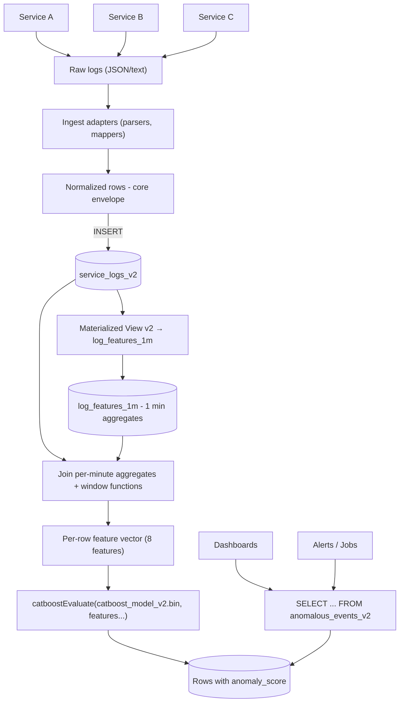

## Production Log Anomaly Detection – Design Guide

This document explains how to take the v2 pipeline from this repo (ClickHouse + CatBoost + adaptive view) and apply it in a **real production system**, where:

- Different services log **different shapes** (HTTP, gRPC, batch jobs, etc.).
- Errors and exceptions are expressed in many formats (stack traces, custom messages).
- You want a **unified anomaly signal** across the fleet.

The goals:

- **Normalize** diverse logs into a **common envelope**.
- **Derive robust signatures** from heterogeneous error messages.
- **Use ClickHouse + CatBoost** for scalable anomaly scoring.
- Keep room for **future text embeddings** without blocking today’s deployment.

---

## Glossary

This glossary is meant for engineers, SREs, and product stakeholders to share a common vocabulary.

- **ClickHouse**: Columnar OLAP database used to store logs and perform fast aggregations and model scoring.
- **CatBoost**: Gradient-boosted trees library that natively supports categorical features; used here for anomaly scoring.
- **catboostEvaluate**: ClickHouse SQL function that calls a CatBoost model (via the library bridge) to produce predictions for each row.
- **Library bridge**: A sidecar HTTP process started by ClickHouse that loads the CatBoost `.bin` model and executes predictions on batches of features.
- **Core envelope**: The normalized log schema that every service maps into (e.g. `timestamp`, `service_id`, `endpoint`, `status_code`, `latency_ms`, `log_level`, `log_signature`, `log_payload`, `is_anomaly`).
- **`service_logs_v2`**: The main v2 ClickHouse table in this repo that stores normalized, per-request log events with contextual features.
- **`log_features_1m`**: AggregatingMergeTree table that stores 1‑minute aggregates per `service_id` (e.g. total requests, error requests) used for velocity and surge calculations.
- **Materialized View (MV)**: ClickHouse object that reacts to inserts into `service_logs_v2` and updates `log_features_1m` automatically.
- **`anomalous_events_v2`**: Adaptive ClickHouse view that joins `service_logs_v2` with `log_features_1m`, computes contextual features (velocity, error acceleration, is_surge), and calls `catboostEvaluate` to produce `anomaly_score`.
- **`log_signature`**: A normalized, low-cardinality representation of a log event that abstracts away dynamic details (IDs, exact messages) and focuses on the pattern (e.g. `[PAYMENTS]:[TimeoutException]:[call_gateway]`).
- **`log_payload`**: The raw or semi-structured error message / stack trace; kept for debugging and future text embeddings but not directly passed into `catboostEvaluate`.
- **`error_kind`**: High-level error category such as `TIMEOUT`, `CONNECTION`, `VALIDATION`, `DEPENDENCY_FAILURE`; derived from exception types, messages, or error codes.
- **`throughput_velocity`**: A feature that compares the current minute’s request volume to the recent past (10‑minute sliding window), used to detect surges in traffic.
- **`error_acceleration`**: A feature that compares the current error rate to the error rate 10 minutes ago to capture how quickly errors are ramping up.
- **`is_surge`**: A binary flag derived from the Z‑score of per-minute request counts over a trailing window (e.g. 60 minutes) to indicate an unusual spike in traffic.
- **`FEATURE_COLUMNS_V2`**: Ordered list of model features used in v2 training and inference (numeric first, then categorical), ensuring ClickHouse and Python see the same feature order.
- **Scenario – `festival`**: Synthetic scenario where traffic volume surges (≈10×) over a short window but requests are healthy (status 200); used to verify the system does not overreact to benign surges.
- **Scenario – `silent_failure`**: Synthetic scenario where volume is normal but a new / rare `log_signature` appears (e.g. unexpected empty result); used to test the model’s ability to detect subtle anomalies.
- **Training view**: A dedicated ClickHouse view/table that defines exactly which events (and labels) are used for training, separate from the live log table.
- **TTL (Time To Live)**: Retention configuration in ClickHouse specifying how long data is kept (e.g. `log_features_1m` retains only 8–14 days of aggregates).

---

## 1. Core Envelope Schema

In production, don’t try to make every log identical. Instead, define a **minimal core schema** that every service must emit, and allow extra fields per service.

Recommended core columns (equivalent of `service_logs_v2`):

- **timestamp**: log event time.
- **service_id**: logical service name (`payments`, `catalog`, `auth-api`, etc.).
- **endpoint** / **operation**:
  - HTTP: route or normalized path (`/orders/{id}` → `/orders/*`).
  - gRPC: method name (`OrderService/CreateOrder`).
  - Batch / jobs: job or task name (`daily-reconcile`, `etl-user-sync`).
- **status_code** or **outcome**:
  - HTTP: exact code (200, 404, 503).
  - Non-HTTP: use a small enum (`SUCCESS`, `FAIL`, `RETRY`, `CANCELLED`).
- **response_time_ms** / **latency_ms**: duration in milliseconds.
- **log_level**: `INFO`, `WARN`, `ERROR`, `FATAL`.
- **error_kind**: coarse error category (see §2.3).
- **log_signature**: normalized pattern / signature (see §2).
- **log_payload**: raw/semi-structured message (for debugging + future embeddings).
- **is_anomaly** (optional):
  - 0/1 label for training / evaluation, **not required** at ingest in production.

You can extend this schema with:

- `trace_id`, `span_id`, `correlation_id`.
- `tenant_id`, `user_id` (if allowed; watch PII).
- Service-specific metadata (`db_shard`, `queue_name`, etc.).

In ClickHouse, this is a **MergeTree** table ordered by `(timestamp, service_id)` with proper TTL / partitioning.

---

## 2. Robust `log_signature` Design

Raw log messages differ wildly; you need a **stable, low-cardinality signature** to detect:

- **New types of failures** (rare or unseen patterns).
- **Known error patterns** that spike suddenly (e.g. timeouts).

### 2.1. General principle

For each log, derive `log_signature` from **structure, not from literal text**:

- Use **exception class**, **module/function**, and **high-level action**.
- Replace dynamic tokens (IDs, emails, GUIDs, exact values) with placeholders.
- Make the grammar **small and explicit**, e.g.:
  - `[SERVICE]:[ACTION]:[RESULT]`
  - `[SERVICE]:[EXCEPTION_CLASS]:[TOP_FRAME]`

### 2.2. Examples

**HTTP error:**

- Raw: `GET /orders/123 failed with status 502 upstream timeout`
- Signature:
  - `service_id = "orders-api"`
  - `endpoint_group = "/orders/*"`
  - `status_class = "5xx"`
  - `log_signature = "[ORDERS]:[/orders/*]:[5xx]"`.

**gRPC / internal call:**

- Raw: `Call to PaymentGateway.charge failed: TimeoutException after 2000ms`
- Signature:
  - `service_id = "payments"`
  - `error_kind = "TIMEOUT"`
  - `log_signature = "[PAYMENTS]:[PaymentGateway.charge]:[TIMEOUT]"`.

**Custom exception:**

- Raw: `OrderValidationException: missing field 'shippingAddress'`
- Signature:
  - `service_id = "checkout"`
  - `exception_class = "OrderValidationException"`
  - `log_signature = "[CHECKOUT]:[OrderValidationException]:[VALIDATION]"`.

### 2.3. Implementing `error_kind`

Create a small, fixed set of categories:

- `TIMEOUT`, `CONNECTION`, `DEPENDENCY_FAILURE`, `VALIDATION`, `UNEXPECTED`, `THROTTLED`, `AUTH`, `NOT_FOUND`, etc.

Implement a **mapping layer** (at ingest or preprocessing) that:

- Parses the error text / exception.
- Assigns `error_kind` based on:
  - Exception types.
  - Error codes from dependencies.
  - Known substrings (e.g. `timeout`, `connection reset`).

This makes it easier to:

- Build signatures.
- Slice metrics.
- Evolve the model without changing raw log formats.

---

## 3. Handling Heterogeneous Log Sources

Most production systems have multiple logging patterns:

- Structured JSON logs.
- Text logs via stdout / files.
- Different log frameworks (Log4j, Serilog, etc.).

The strategy:

1. **Ingest adapters per source type:**
   - For each “log source” (service or framework), write an adapter that:
     - Parses its native format (JSON, text, protobuf).
     - Emits the **core envelope** into ClickHouse (or a message bus feeding ClickHouse).
   - This can be:
     - A Logstash / Vector / Fluent Bit pipeline.
     - An internal Go/Python service reading from Kafka.

2. **Normalize at the edge:**
   - Don’t push a ton of parsing into ClickHouse itself; instead, do it at ingest:
     - Extract `service_id`, `endpoint`, `status_code`, etc.
     - Derive `log_signature` and `error_kind`.
     - Forward the normalized row to ClickHouse.

3. **Versioned contracts:**
   - Add `schema_version` if you foresee schema evolution.
   - Maintain a per-service schema doc that maps original fields → envelope fields.

---

## 4. `log_payload` and Text Features

### 4.1. Current limitation (ClickHouse)

CatBoost supports text features, but the **ClickHouse `catboostEvaluate` bridge does not**:

- It expects **numeric + categorical** inputs only.
- Models that include text features will fail with:
  - `CANNOT_APPLY_CATBOOST_MODEL: Model contains text features but they aren't provided`.

In this repo, we resolved this by:

- Training the v2 model with **8 numeric + categorical features only**.
- Keeping `log_payload` in the table and views for:
  - Debugging.
  - Future embeddings.
  - Python-side models.

### 4.2. Production approach for text

To use text in production while staying ClickHouse-compatible:

1. **Precompute numeric text features**:
   - Simple features:
     - Count of “timeout”, “connection reset”, “validation error”.
     - Length of message, number of stack frames, etc.
   - Advanced:
     - Embedding vectors from a small text encoder (e.g. 16–64 dims).
     - Per-message log-likelihood from a language model (how “weird” the text is).

2. **Store these as numeric columns**:
   - e.g. `payload_emb_1` … `payload_emb_16`.
   - Or aggregated scores: `payload_anomaly_score`.

3. **Include them in the model feature list**:
   - Extend `FEATURE_COLUMNS_V2` with these numeric columns.
   - Retrain the model in Python.
   - Update the ClickHouse view DDL to pass the same numeric features to `catboostEvaluate`.

4. **Keep raw `log_payload` for humans and offline models**:
   - Support richer Python-only models which can directly use text.
   - Use these to prototype better features without impacting the live ClickHouse path.

---

## 5. Labels and Ground Truth in Production

Unlike the POC, production ingest flows **do not know** `is_anomaly` at write time. You have several options to generate labels for training/evaluation:

### 5.1. Rule-based labels (bootstrapping)

Define simple rules:

- `is_anomaly = 1` if:
  - `status_code >= 500`, or
  - `log_level in ('ERROR','FATAL')`, or
  - `error_kind in ('TIMEOUT','DEPENDENCY_FAILURE')`, or
  - `exception_class` in a curated list.

Use these labels to:

- Train an initial supervised model.
- Provide a baseline for precision/recall tracking.

### 5.2. Incident / alert-derived labels

Link anomalies to **real incidents**:

- When an incident is declared (PagerDuty, Opsgenie, etc.), record:
  - `incident_id`, `service_id`, time window.
- Mark all logs in `[t_incident - Δ, t_incident + Δ']` as `is_anomaly=1` for that service.

This yields more realistic ground truth:

- Not every 5xx is critical.
- Some anomalies involve subtle patterns (e.g. silent data corruption).

### 5.3. Unsupervised / semi-supervised

In some environments labels are scarce:

- Train models on mostly “normal” data; treat dense regions as normal, outliers as anomalous.
- You can still use:
  - The same feature store (`log_features_1m`).
  - The same adaptive view (`anomalous_events_v2`).
  - Only the training objective / loss changes.

In all cases, keep a **training view** (e.g. `training_events_v2`) separate from the live log table so you understand exactly what the model saw.

---

## 6. Deployment Pattern (ClickHouse + CatBoost)

The recommended production pattern is:

1. **Train offline** (Python):
   - Read from ClickHouse (`service_logs_v2` or `training_events_v2`).
   - Train CatBoost with:
     - Numeric features first.
     - Categorical features explicitly listed.
     - Optional numeric text features (precomputed).
   - Save `.bin` model artifact (`catboost_model_v2.bin`).

2. **Ship model to ClickHouse**:
   - Mount the project root (or a model directory) into the ClickHouse container.
   - Update `MODEL_PATH_V2_IN_CONTAINER` to match the in-container path.

3. **Create/update the view**:
   - Run a small script (`create_view.py`) which:
     - Executes `CREATE OR REPLACE VIEW anomalous_events_v2 AS ... catboostEvaluate(model_path, features ...)`.
   - Keep the **view DDL version-controlled**.

4. **Runtime scoring**:
   - Downstream systems query `anomalous_events_v2` directly:
     - Dashboards.
     - Alerting rules.
     - Further analytics.

5. **Model updates**:
   - Retrain model offline.
   - Replace `.bin` on disk.
   - Re-run the view creation script.
   - Optionally tag/record model version in a small metadata table.

---

## 7. Multi-Service and Schema Evolution

In a large system, services evolve and new ones appear. To keep anomaly detection robust:

1. **Per-service schema mapping**:
   - For each service or log source, maintain a mapping doc:
     - Native field → envelope field.
   - Ensure each mapping produces:
     - `timestamp`, `service_id`, `endpoint`, `outcome/status`, `latency_ms`.
     - `log_signature`, `error_kind`, `log_level`.

2. **Stable core, extensible extras**:
   - Core envelope stays stable over time (model compatibility).
   - Extras are allowed per service but:
     - Only carefully-chosen extras become **model features**.
     - Others are kept for debugging / slice-and-dice analysis.

3. **Versioning**:
   - Introduce `schema_version` for breaking changes.
   - Allow the training view (`training_events_v2`) to filter or adjust based on version.

---

## 8. Thresholds, SLOs, and Ops Integration

An anomaly score alone isn’t enough; you need thresholds aligned with **SLOs** and **alerting**:

1. **Global baseline**:
   - Compute a score distribution per service (e.g. 90th/95th percentile).
   - Use a conservative global threshold initially.

2. **Per-service thresholds**:
   - Some services are noisier or more critical.
   - Store thresholds in a small config table:
     - `service_id`, `threshold`, `last_updated_by`, `notes`.

3. **Integrate with alerting**:
   - Build derived views or queries that:
     - Count anomalies over sliding windows.
     - Trigger alerts when counts/z-scores exceed bounds.

4. **Runbook linkage**:
   - When an alert fires, include:
     - Example rows from `anomalous_events_v2`.
     - `log_signature`, `error_kind`, and pointers to raw logs (`log_payload`).

---

## 9. How This Repo Maps to Production

This repo provides a **concrete reference implementation**:

- `service_logs_v2` – normalized envelope with contextual features.
- `log_features_1m` + MV – feature store for throughput and error metrics.
- `log_signature` – synthetic but structured signature space.
- `anomalous_events_v2` – adaptive view combining per-request and per-minute context.
- `scripts/validate_anomaly_output.py` – per-view validation of score distributions and precision/recall.

To bring this into your production system:

1. Implement **ingest adapters** from real logs into a `service_logs_v2`-like table.
2. Derive **`log_signature`** and **`error_kind`** as described above.
3. Stand up **log_features_1m** and adaptive view logic in your ClickHouse cluster.
4. Train a CatBoost model on real data (using your labeling strategy).
5. Deploy the model and view as described in §6.
6. Iterate on:
   - Precomputed text features.
   - Per-service thresholds.
   - Label quality and coverage.

This design keeps a clear separation between:

- **Data normalization** (per-service, at ingest).
- **Feature engineering** (shared schemas and feature store).
- **Modeling and inference** (Python + ClickHouse).

which is what you want for a maintainable, production-grade anomaly detection system. 

---

## 10. Current POC Execution Flow (How the Model Is Invoked)

This section summarizes **how the current repo works today**, end-to-end, and how the model is invoked on each log row.

### 10.1. Training path

1. **Ingest v2 logs** into `service_logs_v2`:
   - `python ingest.py -n 50000 --scenario normal`
   - Optionally `--scenario festival` / `--scenario silent_failure` for scenario coverage.
2. **Train the v2 model**:
   - `python train.py`
   - This:
     - Calls `load_training_data(use_v2=True)` to read from `service_logs_v2`.
     - Uses `FEATURE_COLUMNS_V2` (8 numeric+categorical features) as `X`.
     - Uses `TARGET = "is_anomaly"` as `y`.
     - Fits a `CatBoostClassifier` (no `text_features`).
     - Saves `catboost_model_v2.bin` in the project root.
3. The model file is mounted into the ClickHouse container as:
   - `MODEL_PATH_V2_IN_CONTAINER = "/workspace/catboost_model_v2.bin"`.

### 10.2. Feature store and aggregates

When `service_logs_v2` is populated:

1. A **materialized view** writes into `log_features_1m`:
   - For each `INSERT` into `service_logs_v2`, it:
     - Buckets `timestamp` to `toStartOfMinute(timestamp)` as `window_start`.
     - Aggregates by `(service_id, window_start, hour_of_day)` into:
       - `total_reqs = countState()`.
       - `error_reqs = countIfState(status_code >= 500)`.
2. `log_features_1m` is an `AggregatingMergeTree` table storing **aggregate states** per minute.
3. At query time, these are merged via `countMerge` / `countIfMerge` to recover:
   - Per-minute `total_reqs`.
   - Per-minute `error_reqs`.

### 10.3. Adaptive v2 view (`anomalous_events_v2`)

The `src/inference.py` module defines `get_anomalous_events_view_v2_ddl` which creates:

- A view `anomalous_events_v2` with the following structure:
  1. **CTEs:**
     - `merged`: merges aggregate states from `log_features_1m`.
     - `with_rates`: adds `error_rate = error_reqs / total_reqs`.
     - `with_velocity`: computes, per `(service_id, window_start)`:
       - `throughput_velocity` over a 10-minute sliding window (`ROWS BETWEEN 9 PRECEDING AND CURRENT ROW`).
       - `error_acceleration` as `error_rate_current / error_rate_10mins_ago` using `lagInFrame`.
       - `is_surge` as a Z-score over 60 minutes of `total_reqs`.
  2. **Main SELECT:**
     - Reads each row `l` from `service_logs_v2`.
     - LEFT JOINs `with_velocity` on:
       - `l.service_id = b.service_id`
       - `toStartOfMinute(l.timestamp) = b.window_start`.
     - Produces per-row features:
       - `status_code`
       - `response_time_ms`
       - `throughput_velocity` (coalesced to `1` if missing)
       - `error_acceleration` (coalesced to `0` if missing)
       - `hour_of_day`
       - `service_id`
       - `endpoint`
       - `log_signature`
     - Calls:
       - `catboostEvaluate(model_path, status_code, response_time_ms, throughput_velocity, error_acceleration, hour_of_day, service_id, endpoint, log_signature) AS anomaly_score`.

**Important:** There is **no persisted anomaly_score table**. The model is invoked **on each row returned by any query against `anomalous_events_v2`**.

- Every `SELECT ... FROM anomalous_events_v2`:
  - Reads raw per-log data.
  - Joins in per-minute context.
  - Computes window features.
  - Calls `catboostEvaluate` row-wise (internally in batches) via the library bridge.

### 10.4. Mermaid diagram of the current flow

This diagram matches the current implementation:

- `train.py` → `catboost_model_v2.bin`.
- `service_logs_v2` + `log_features_1m` + `anomalous_events_v2`.
- `catboostEvaluate` invoked on-demand for each row returned by a query against `anomalous_events_v2`.

